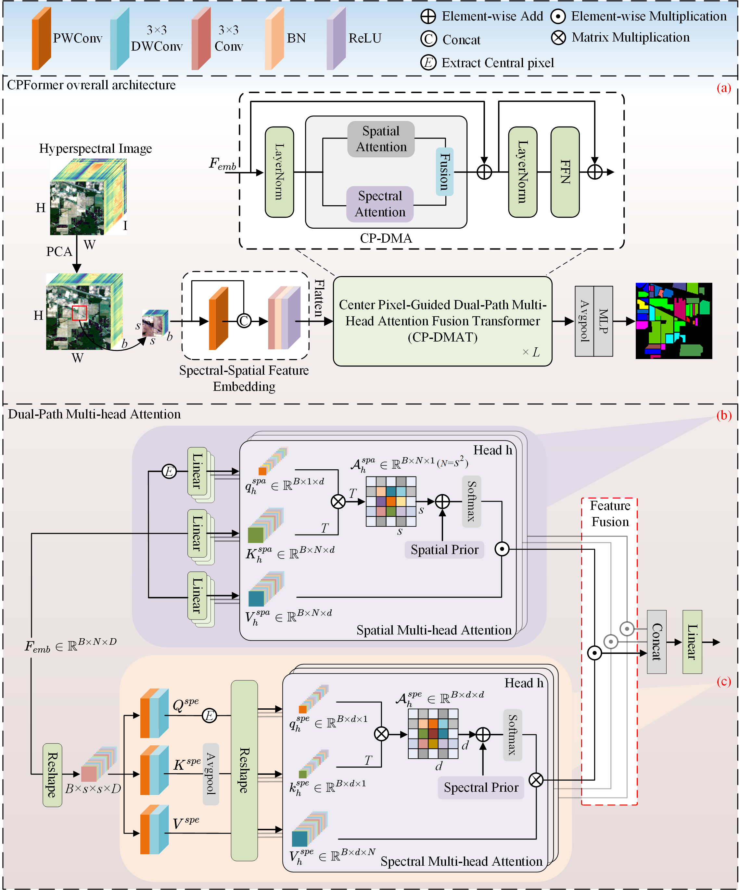

# [TGRS 2026] Center-Pixel Guided Dual-Path Multihead Attention Fusion Transformer for Hyperspectral Image Classification

**Haobo Jiang, Qiankun Gao, Haobing Chen and Bin Zhou**

Companion PyTorch experiment code. Official paper repository: [https://github.com/Jianghaob/CPFormer](https://github.com/Jianghaob/CPFormer).

---

## Contents

1. [Brief Introduction](#brief-introduction)
2. [CPFormer Framework](#cpformer-framework)
3. [Environment](#environment)
4. [Data Sets and File Hierarchy](#data-sets-and-file-hierarchy)
5. [Running](#running)
6. [Citation](#citation)

---

## Brief Introduction

> The performance of hyperspectral image classification (HSIC) relies on the deep integration of spatial and spectral information. Although mainstream Transformer architectures can capture global context, they often overlook the key inductive bias that “the central pixel determines the category,” and also incur high computational costs. Moreover, traditional linear fusion strategies (such as concatenation or element-wise addition) struggle to capture the complex nonlinear interactions between spatial and spectral dimensions. To address these issues, this paper proposes a central-pixel guided dual-path multi-head attention transformer (CPFormer). The model first introduces a spatial-spectral feature embedding (SSFE) module, which generates robust initial representations while preserving inherent spectral characteristics. Guided by the central pixel principle, a dual-path multi-head attention (CP-DMA) module is then proposed: the spatial path uses the central pixel as the Query and incorporates 2D Gaussian positional encoding to enhance local perception; the spectral path employs depthwise separable convolution and bidirectional spectral decay prior to model spectral (channel) continuity. Furthermore, CP-DMA adopts element-wise multiplication for spatial–spectral fusion, enabling adaptive and nonlinear feature interaction. Information plane analysis further confirms that, compared with linear fusion, the multiplication strategy can more effectively compress redundant information and drive feature representations closer to the “minimum sufficient statistic” in information theory. Extensive experiments on four benchmark datasets under limited training samples demonstrate that CPFormer outperforms state-of-the-art methods in classification performance. The source code will be available at: [https://github.com/Jianghaob/CPFormer](https://github.com/Jianghaob/CPFormer).

---

## CPFormer Framework

<table>
  <tr>
    <td colspan="1" align="center">
      <b>CPFormer Framework</b><br/>
      
    </td>
  </tr>
</table>

---

## Environment

- Experiments on **IP**, **UP**, and **HU13** were conducted on a workstation equipped with an Intel® Core™ i9-13900HX processor (2.20 GHz), 16 GB of RAM, and a single NVIDIA GeForce RTX 4060 GPU (8 GB VRAM); **HU18** was conducted on a server equipped with an Intel® Xeon® Gold 6459C processor, 94 GB of RAM, and a single NVIDIA RTX A6000 GPU (48 GB VRAM).
- We adopt Python 3.12.12, Pytorch 2.4.0+cu118

Installation:

1. Install `torch` and `torchvision` for your CUDA version from the [PyTorch website](https://pytorch.org/get-started/locally/).
2. From this repository root (where this README lives), run:

```bash
pip install -r requirements.txt
```

**Note:** `fvcore` is used for FLOPs estimation on some two-branch models; if it is missing, `train_test.py` skips that path and prints a warning. `model/MambaHSI.py` depends on `mamba-ssm`; the default entry script does not load that model—install separately only if you use it.

---

## Data Sets and File Hierarchy

### Supported datasets and files (default: `data/`)

Set the dataset code and root path via `dataset.name` and `dataset.data_path` in `config/config.py` (default root is `./data`).

| Code | Data cube (example filename) | Labels (example filename) |
| --- | --- | --- |
| `IP` | `Indian_pines_corrected.mat` | `Indian_pines_gt.mat` |
| `UP` | `PaviaU.mat` | `PaviaU_gt.mat` |
| `HU13` | `DFC2013_Houston.mat` | `DFC2013_Houston_gt.mat` |
| `HU18` | `HoustonU.mat` | `HoustonU_gt.mat` |

Some `.mat` files use Matlab v7.3 (HDF5). The code falls back to `h5py` where needed (e.g., **HU18**).

### Repository layout (summary)

```
GaoQianKun_hsi/
├── README.md
├── requirements.txt
├── train_test.py              # Main training / testing entry
├── config/
│   └── config.py              # Dataset, model name, hyperparameters (EXPERIMENT_CONFIG / MODEL_SPECS)
├── model/
│   ├── CPFormer.py
│   ├── CVSSN.py, SQSFormer.py, DBDA.py, SSFTT.py, SF.py, s2ftnet.py, HMSSF3.py, CWSST.py, …
│   └── …
├── utils/
│   ├── data_load_operate.py   # IO, sampling, PCA, DataLoader
│   ├── evaluation.py
│   └── …
├── visual/
│   └── cls_visual.py          # Classification maps
├── data/                      # Put the .mat files here (download separately; not tracked)
├── output/                    # Outputs under <dataset>/<model>/ (maps + result txt)
└── src/
    └── CPFormer_Framework.png # Framework figure (place file here)
```

---

## Running

1. Edit `config/config.py`: set `model_name` (e.g. `CPFormer`), `dataset.name`, and training options.
2. Copy the required `.mat` files into `data/` (or your `data_path`).
3. Run:

```bash
python train_test.py
```

Logs and maps are written under `output/<dataset_name>/<model_name>/`, including `cls_maps/` and `results/`.

---

## Citation

If you use this work or code, please cite:

```bibtex
@ARTICLE{11382038,
  author={Jiang, Haobo and Gao, Qiankun and Chen, Haobing and Zhou, Bin},
  journal={IEEE Transactions on Geoscience and Remote Sensing}, 
  title={Center-Pixel Guided Dual-Path Multihead Attention Fusion Transformer for Hyperspectral Image Classification}, 
  year={2026},
  volume={64},
  number={},
  pages={1-18},
  keywords={Transformers;Feature extraction;Encoding;Hyperspectral imaging;Computational modeling;Adaptation models;Image classification;Attention mechanisms;Three-dimensional displays;Standards;Center-pixel guidance;dual-path attention;hyperspectral image classification (HSIC);multiplicative fusion},
  doi={10.1109/TGRS.2026.3662353}}
```
